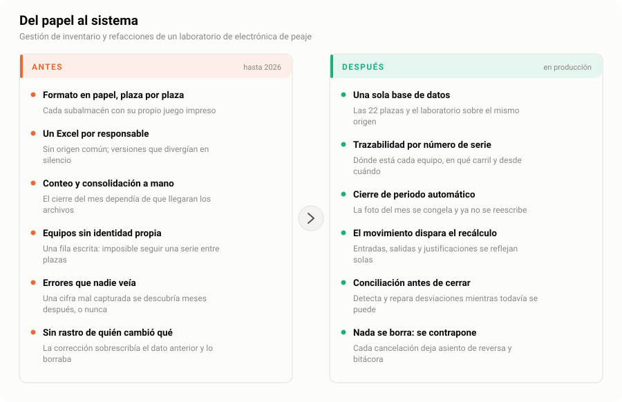
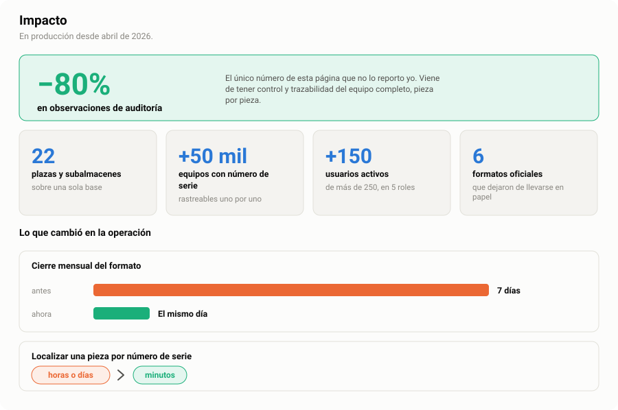
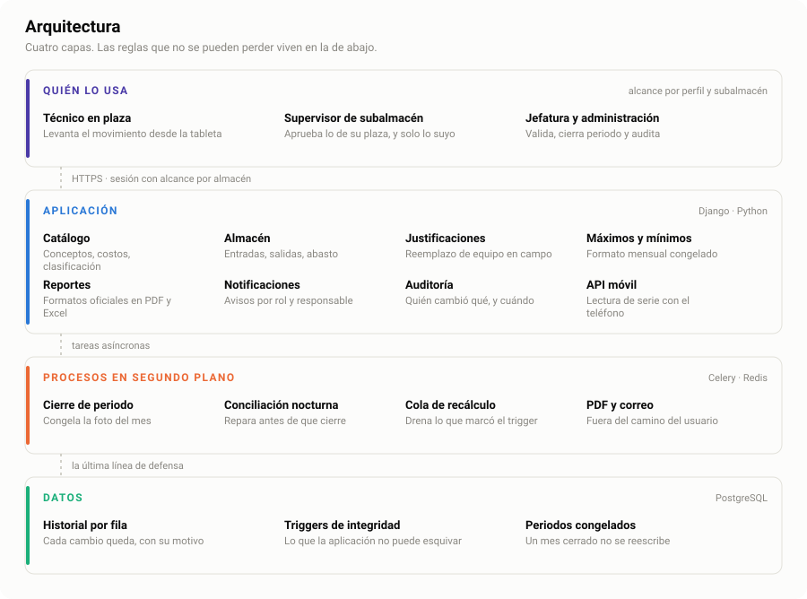
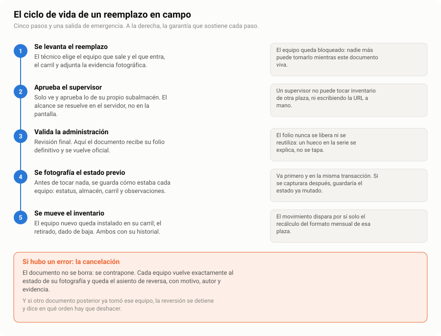

# ERP de almacén para un laboratorio de electrónica de peaje

**Un sistema interno que sustituyó formatos en papel y hojas de cálculo por plaza con un inventario único y trazable.**
En producción desde abril de 2026 en 22 plazas, con más de 50,000 equipos rastreados por número de serie — y las observaciones de auditoría bajaron 80%.

Este repositorio **no contiene código fuente**. Documenta la ingeniería: cuáles eran los problemas, qué decisiones se tomaron y cómo se verificaron.

`Django` · `PostgreSQL` · `Celery` · `Redis`

🇬🇧 [Read in English](README.md)

---

## Por qué existe este repositorio

Casi todos los repositorios de portafolio muestran código. El código es lo fácil de mostrar y lo difícil de juzgar fuera de contexto: viendo un archivo no se puede saber si la decisión difícil se tomó bien.

Así que este muestra las decisiones. Dos están documentadas completas, con la falla que las provocó, las opciones que había, el intercambio que se eligió y la prueba que demostró que funcionaba:

- **[Corrupción silenciosa en un formato mensual congelado](docs/case-study-01-data-integrity.es.md)** — cómo el 87% de un formato oficial se había desincronizado sin que nadie lo notara, y por qué el candado tuvo que vivir en la base de datos y no en la aplicación.
- **[Deshacer un documento sin corromper el inventario](docs/case-study-02-reversal-guardrail.es.md)** — lo que hace falta para revertir una transacción aprobada en un sistema de inventario, y qué hacer cuando el dato necesario para revertirla nunca se capturó.

Si solo vas a leer una cosa de aquí, que sea la primera.

---

## El problema

<picture>
  <source media="(prefers-color-scheme: dark)" srcset="assets/antes-despues-es-dark.svg">
  
</picture>

Un laboratorio de electrónica de peaje mantiene vivo el equipo de campo: lectores RFID, barreras, cámaras, controladores y las refacciones de todos ellos, repartidos en plazas de varias autopistas.

El registro de todo eso vivía en formatos impresos y en una hoja de cálculo por responsable. Cada plaza llevaba la suya. Nada ligaba una pieza física con una fila, así que un número de serie no se podía seguir del almacén al carril donde terminó instalado. La consolidación de fin de mes era manual y dependía de que llegaran todos los archivos. Un número mal capturado salía a flote meses después, si acaso, y la corrección sobrescribía el original: no quedaba forma de saber qué había cambiado ni quién lo cambió.

Nada de eso es raro. Así se ve una operación antes de que alguien le construya un sistema.

---

## Impacto

<picture>
  <source media="(prefers-color-scheme: dark)" srcset="assets/impacto-es-dark.svg">
  
</picture>

La cifra a la que apuntaría primero es la **caída del 80% en observaciones de auditoría**, porque es la única de aquí que midió alguien ajeno al proyecto. Todo lo demás en esta página lo reporto yo; esa vino de vuelta en una auditoría. Y es además la que explica a las otras: las observaciones bajan cuando cada pieza tiene identidad, ubicación e historial que cuadra, porque sencillamente hay menos qué observar.

La segunda en la que vale la pena detenerse es el cierre mensual. Antes tomaba **siete días** de juntar hojas de cálculo, conciliarlas a mano y perseguir a las plazas que no habían mandado la suya. Hoy cierra **el mismo día, y los números cuadran**, porque la conciliación corre todas las noches contra los datos de origen en vez de contra lo que cada plaza capturó, y porque un mes cerrado queda congelado al nivel de la base de datos y no por convención. El [caso 1](docs/case-study-01-data-integrity.es.md) es la historia de haber acertado en esa última parte, que costó dos intentos.

La tercera es menos visible y pesa igual en el día a día: **localizar una pieza por su número de serie** tomaba horas, a veces días de llamadas entre plazas. Hoy toma segundos, porque cada equipo tiene identidad propia y su historial completo: de dónde vino, en qué carril está y cada documento que lo tocó alguna vez.

---

## Lo que lo sustituyó

<picture>
  <source media="(prefers-color-scheme: dark)" srcset="assets/arquitectura-es-dark.svg">
  
</picture>

Una sola aplicación sobre una sola base de datos, y cada pieza física con identidad propia: número de serie, estatus actual, el almacén donde está y el carril donde quedó instalada, si es el caso.

El principio de diseño vale la pena enunciarlo: **lo que no se puede perder se empujó lo más abajo que llegara.** El alcance de permisos se resuelve en el servidor, nunca en la plantilla. El congelado del formato mensual se aplica en la primera línea del método que escribe, no confiando en que seis llamadores se acuerden de pasar una bandera. Y la única regla que la propia aplicación podía esquivar se movió a un trigger de base de datos, donde ningún camino de código puede saltársela. Eso último es el [caso 1](docs/case-study-01-data-integrity.es.md).

---

## El dominio, en una imagen

La operación central es un **reemplazo en campo**: una pieza falla en un carril, un técnico la cambia, y el documento que registra el cambio tiene que mover el inventario y sobrevivir a estar equivocado.

<picture>
  <source media="(prefers-color-scheme: dark)" srcset="assets/flujo-justificacion-es-dark.svg">
  
</picture>

Lo interesante es el paso 4 y el bloque naranja. Todo lo demás es un flujo de trabajo que tiene cualquier sistema; esos dos son los que hacen la operación reversible — y la reversibilidad, en un inventario que leen auditores, lo es todo. El [caso 2](docs/case-study-02-reversal-guardrail.es.md) trata de qué pasa cuando hay que deshacer un documento.

---

## Cómo se construyó

Un solo desarrollador, trabajando junto a la gente que lo usa. Sin ceremonia de ningún marco de trabajo; lo que sí hubo fue una disciplina de entrega, y es la razón de que el sistema aguantara mientras crecía debajo de una operación viva:

**Entregado por fases, nunca de un solo corte.** Cada capacidad salió como una fase numerada con su propia nota de cambios. El laboratorio siguió trabajando todo el tiempo; a nadie se le pidió detenerse a migrar.

**Cada entrega lleva su runbook.** Los archivos a subir, el comando de respaldo, las comprobaciones que confirman que producción es lo que creemos *antes* de sobrescribir nada, las pruebas posteriores y la vuelta atrás. Escrito antes del despliegue, no después.

**Auditar antes de cambiar.** Cada arreglo de los casos de estudio empezó con un comando de solo lectura que midió el problema. El número decidía después el diseño, y dos veces mató el camino que yo prefería, que es justo para lo que sirve medir.

**Estado de migraciones rastreado de forma explícita.** La numeración de migraciones de local y producción se bifurcó pronto. En vez de forzarlas a reunirse sobre una base de datos viva, la bifurcación está documentada y cada migración nueva sale con su variante de producción.

**Pruebas sobre los caminos irreversibles.** No en todas partes: en la matriz de permisos, la reversión, el guardarraíl y el congelado del periodo. Donde equivocarse sale caro y en silencio.

Vale decirlo sin adorno: esta es la práctica como quedó, no como se planeó. Los primeros meses tuvieron mucho menos de esto. Casi todos estos hábitos existen porque algo salió mal una vez, y los runbooks son lo que ese costo compró.

---

## Notas de ingeniería

**La seguridad se aplica, no se supone.** El alcance de permisos vive en el servidor: un supervisor de plaza que escriba a mano la URL de otra plaza no obtiene nada. Las operaciones irreversibles vuelven a pedir la contraseña. Las cancelaciones tienen límite de frecuencia por usuario, no por IP, porque varios técnicos comparten la dirección de la plaza y un límite por IP los castigaría entre sí. Los mensajes de error se parten: el detalle técnico va a administradores y al log, un mensaje limpio para los demás, porque el texto crudo de un error de base de datos es un mapa gratuito del esquema.

**Nada se borra.** Las correcciones se contraponen, como una nota de crédito en contabilidad. Un documento cancelado conserva su folio — el hueco en la serie se explica, no se tapa — y cada campo restaurado queda escrito en un asiento de reversa con su motivo, su autor y su evidencia.

**Historial por fila sobre el inventario.** Cada cambio en una pieza se conserva junto con la razón por la que ocurrió, que es lo que permite que un auditor pregunte "¿por qué este lector pasó de instalado a stock el día 21?" y obtenga una respuesta que no dependa de la memoria de nadie.

---

## Nota sobre confidencialidad

Este repositorio no contiene código fuente, ni datos de operación, ni cifras identificables. No aparecen nombres de plazas, de clientes ni números de serie; los volúmenes se reportan por orden de magnitud, y las cifras que sí son exactas vienen de auditorías que corrí contra la consistencia del propio sistema, no del negocio al que sirve.

Lo que se describe aquí son decisiones de ingeniería y el razonamiento detrás de ellas. Eso sí me corresponde comentarlo. El sistema, sus datos y su código no, y no se publican aquí.

---

## Sobre mí

Soy **Daniel Soto Zamora**, ingeniero en telecomunicaciones y electrónica, trabajando en infraestructura de peaje y sistemas inteligentes de transporte: lectores RFID, barreras y electrónica de campo por un lado, y el software que lleva la cuenta de todo eso por el otro. Este sistema es la segunda mitad.

**Daniel Soto Zamora** — [LinkedIn](https://linkedin.com/in/dsotoz18) · [GitHub](https://github.com/dsotoz1821) · [danny14.soza@gmail.com](mailto:danny14.soza@gmail.com)
