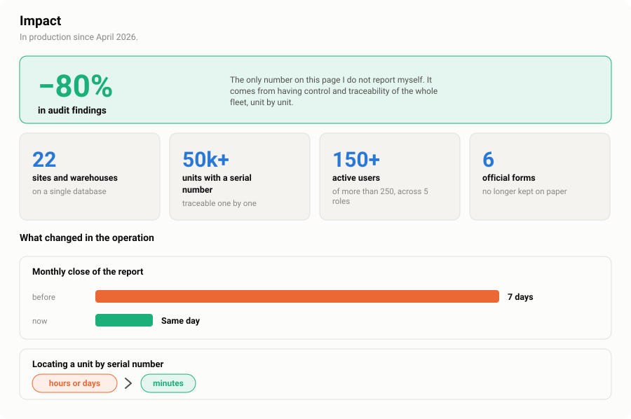
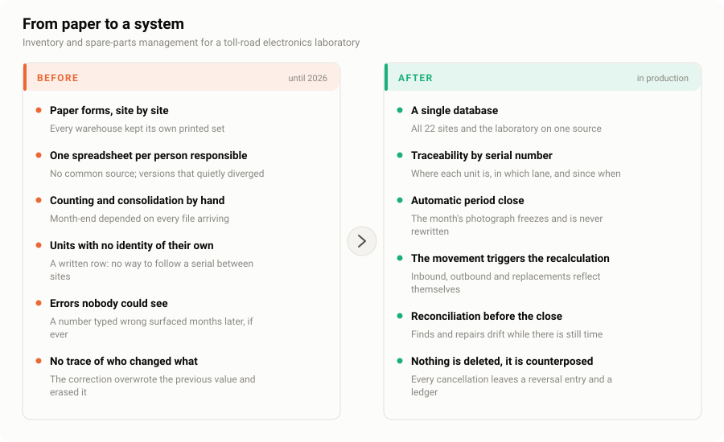
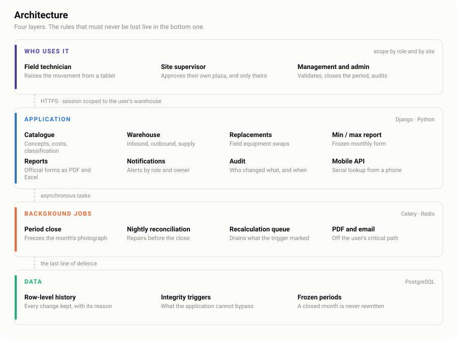
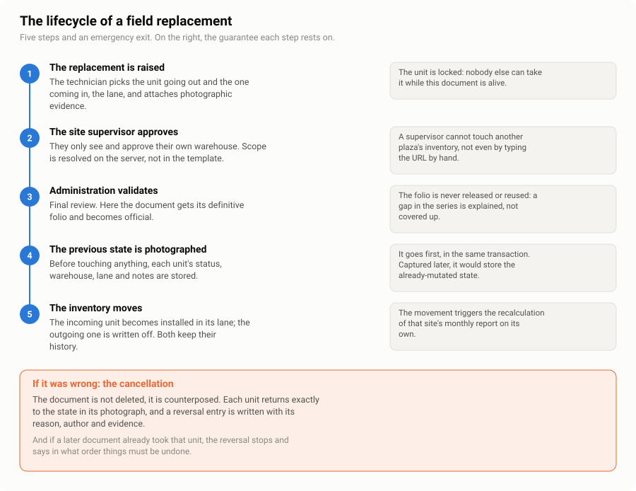

# Warehouse ERP for a toll-road electronics laboratory

**An internal system that replaced paper forms and per-site spreadsheets with a single traceable inventory.**
In production since April 2026 across 22 sites, tracking more than 50,000 units by serial number — and audit findings are down 80%.

This repository contains **no source code**. It documents the engineering: what the problems were, which decisions were made, and how they were verified.

`Django` · `PostgreSQL` · `Celery` · `Redis`

🇪🇸 [Leer en español](README.es.md)

---

## Impact

<picture>
  <source media="(prefers-color-scheme: dark)" srcset="assets/impacto-en-dark.svg">
  
</picture>

The number I would point a reader at first is the **80% drop in audit findings** — because it is the only one here that someone outside the project measured. Everything else on this page I report myself; that one came back from an audit. It is also the number that explains the others: findings fall when every unit has an identity, a location and a history that reconciles, so there is simply less to find.

The second one worth dwelling on is the monthly close. It used to take **seven days** of collecting spreadsheets, reconciling them by hand and chasing the sites that had not sent theirs. It now closes **the same day, and the figures reconcile** — because the reconciliation runs nightly against source data instead of against whatever each site typed, and because a closed month is frozen at the database level rather than by convention. [Case study 1](docs/case-study-01-data-integrity.md) is the story of getting that last part right, which took two attempts.

The third is less visible and matters as much day to day: **finding a specific unit by its serial number** used to take hours, sometimes days of phone calls between plazas. It takes seconds now, because every unit carries its own identity and its full history — where it came from, which lane it sits in, every document that ever touched it.

---

## Why this repository exists

Most portfolio repositories show code. Code is the easy part to show and the hard part to judge out of context — you cannot tell, from a file, whether the hard decision was made well.

So this one shows the decisions. Two of them are written up in full, with the failure that prompted them, the options considered, the trade-off taken, and the test that proved it worked:

- **[Silent corruption in a frozen monthly report](docs/case-study-01-data-integrity.md)** — how 87% of a regulatory report had drifted out of sync without anyone noticing, and why the fix had to live in the database rather than the application.
- **[Undoing a document without corrupting the inventory](docs/case-study-02-reversal-guardrail.md)** — what it takes to reverse an approved transaction in an inventory system, and what to do when the data needed to reverse it was never captured.

If you only read one thing here, read the first one.

---

## The problem

<picture>
  <source media="(prefers-color-scheme: dark)" srcset="assets/antes-despues-en-dark.svg">
  
</picture>

A toll-road electronics laboratory keeps the field hardware running: RFID readers, barriers, cameras, controllers, and the spare parts for all of them, spread across plazas on several highways.

The record of all that lived in printed forms and in one spreadsheet per person responsible. Each site kept its own. Nothing linked a physical unit to a row, so a serial number could not be followed from the warehouse to the lane it ended up in. Month-end consolidation was manual and depended on every file arriving. A number typed wrong surfaced months later, if ever — and the correction overwrote the original, so there was no way to tell what had changed or who changed it.

None of that is unusual. It is what an operation looks like before anyone builds it a system.

---

## What replaced it

<picture>
  <source media="(prefers-color-scheme: dark)" srcset="assets/arquitectura-en-dark.svg">
  
</picture>

A single application over a single database, with every physical unit carrying its own identity — serial number, current status, the warehouse it sits in, and the lane it is installed in, if any.

The design principle worth stating: **invariants that must never be lost were pushed as far down as they would go.** Permission scope is resolved on the server, never in the template. The monthly report's freeze is enforced on the first line of the method that writes it, not by six callers remembering to pass a flag. And the one rule that the application itself could bypass was moved into a database trigger, where no code path can skip it. That last one is [case study 1](docs/case-study-01-data-integrity.md).

---

## The domain, in one picture

The core operation is a **replacement in the field**: a unit fails in a lane, a technician swaps it, and the document that records the swap has to move the inventory and survive being wrong.

<picture>
  <source media="(prefers-color-scheme: dark)" srcset="assets/flujo-justificacion-en-dark.svg">
  
</picture>

The interesting part is step 4 and the orange block. Everything else is a workflow any system has; those two are what make the operation reversible — and reversibility, in an inventory that auditors read, is the whole game. [Case study 2](docs/case-study-02-reversal-guardrail.md) is about what happens when a document has to be undone.

---

## How it was built

One developer, working alongside the people who use it. No framework ceremony — what there was instead is a release discipline, and it is the reason the system held together while growing under a live operation:

**Delivered in phases, never as a single cutover.** Each capability shipped as a numbered phase with its own change note. The lab kept working throughout; nobody was ever asked to stop and migrate.

**Every release carries a runbook.** The files to upload, the backup command, verification checks that confirm production is what we believe it is *before* anything is overwritten, the post-deploy tests, and the rollback. Written before the deployment, not after it.

**Audit before changing.** Every fix in the case studies began with a read-only command that measured the problem. The number then decided the design — and twice it killed the approach I preferred, which is the point of measuring.

**Migration state tracked explicitly.** Local and production migration numbering diverged early. Rather than force them back together on a live database, the divergence is documented and every new migration ships with its production variant.

**Tests on the irreversible paths.** Not everywhere — on the permission matrix, the reversal, the guardrail and the period freeze. The places where being wrong is expensive and silent.

Worth saying plainly: this is the practice as it ended up, not as it was planned. The first months had much less of it. Most of these habits exist because something went wrong once, and the runbooks are what that cost bought.

---

## Engineering notes

**Security is applied, not assumed.** Permission scope lives on the server: a site supervisor who types another plaza's URL by hand gets nothing. Irreversible operations ask for the password again. Cancellations are rate-limited per user, not per IP — several technicians share a plaza's address and an IP limit would punish them for each other. Error messages are split: the technical detail goes to administrators and the log, a clean message to everyone else, because a raw database error is a free map of the schema.

**Nothing is deleted.** Corrections are counterposed, like a credit note in accounting. A cancelled document keeps its folio — the gap in the series is explained, never covered up — and every restored field is written to a ledger entry with its reason, its author and its evidence.

**Row-level history on the inventory.** Every change to a unit is kept with the reason it happened, which is what lets an auditor ask "why did this reader go from installed to in-stock on the 21st?" and get an answer that does not depend on anyone's memory.

---

## A note on confidentiality

This repository contains no source code, no operational data and no identifiable figures. Plaza names, client names and serial numbers do not appear; volumes are reported as orders of magnitude, and the figures that are exact come from audits I ran against the system's own consistency, not from the business it serves.

What is described here are engineering decisions and the reasoning behind them. Those are mine to discuss. The system itself, its data and its code are not, and are not published here.

---

## About

I am **Daniel Soto Zamora**, a telecommunications and electronics engineer working in toll infrastructure and intelligent transportation systems — RFID readers, barriers and field electronics on one side, and the software that keeps track of all of it on the other. This system is the second half of that.

**Daniel Soto Zamora** — [LinkedIn](https://linkedin.com/in/dsotoz18) · [GitHub](https://github.com/dsotoz1821) · [danny14.soza@gmail.com](mailto:danny14.soza@gmail.com)
